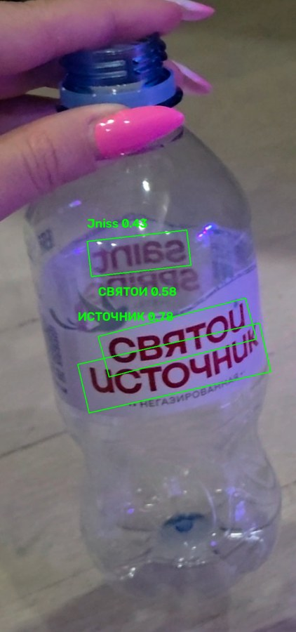
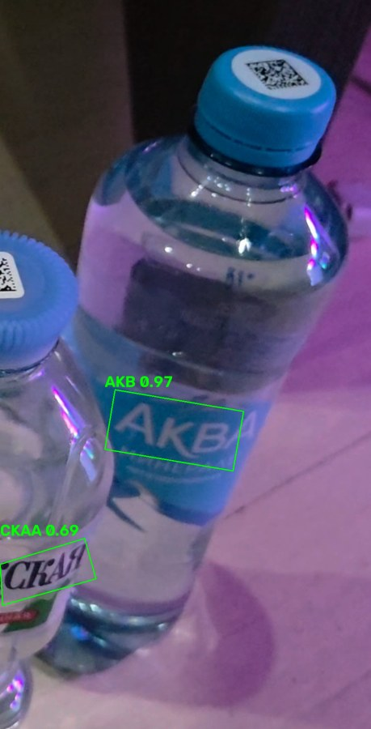
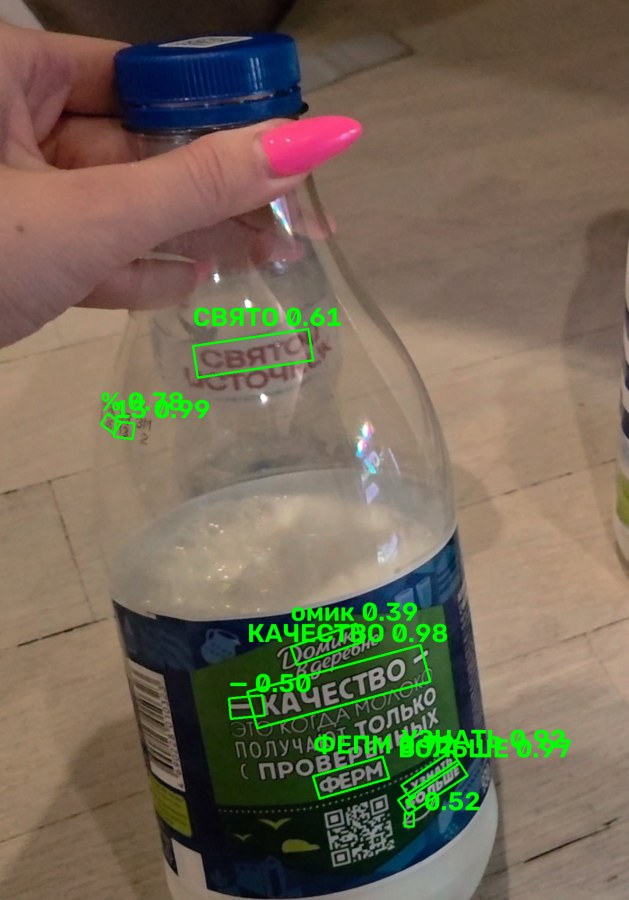
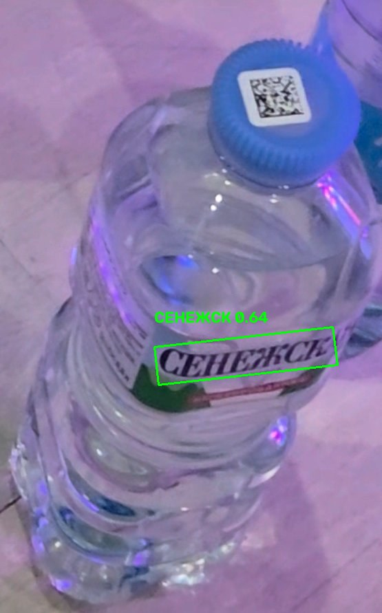

# A/B replay comparison: old vs new pre-OCR quality gate

## Configurations (everything else identical)

- **A (old):** `full-resolution sharpness >= 15`; normalized value ignored.
- **B (new):** production `quality_gate_accepts`: `full >= 15 OR norm@1000 >= 30`.
- Same worktree code for all runs, including the crop-request lifecycle fixes
  (per-track outstanding requests, tombstones, stale drops). The gate was the
  only behavior switched, via a file flag read by the measurement server; the
  server log records the active gate on every crop response and analysis
  asserts all of a run's crops used the intended gate.
- Detector PP-YOLOE+ Small Objects365, 640 inference, CPU; PP-OCRv5 Cyrillic
  CPU OCR; submit intervals 0.75/2 s; dhash dedup; 8-product catalog.
- **Jev disabled explicitly for both gates:** `TYPESAFE_API_KEY` forced empty
  in the server process AND `jev_catalog.classify` replaced by a counting
  guard that raises before any network I/O. No Jev completion exists in this
  experiment, so OCR never stops on accepted identification. **This measures
  OCR-stage behavior only — not full production workload or SKU
  identification.**

## Procedure

Same compatible H.264 videos as the earlier comparison; decode verified (real
3840×2160 frames, readyState 4) in headless Chrome 153. Detector and OCR
warmed by an unmeasured V3 replay; every measured run starts from a fresh
tracking/identification session (POST `/api/reset`, drain verified:
`queue_depth == 0`, no tracks). One replay at a time, normal speed through the
real pipeline (video frame → detection upload → server crop request → retained
original crop → CPU OCR), identical `?diag=1` diagnostics, fixed 20 s
post-roll after video end; work still pending afterward would be marked
incomplete (none was — every run drained to zero). Per video an **A–B–B–A**
sequence (two runs per gate). With two repeats, no statistical significance
is claimed; each run is reported separately.

## Source identity

| Video | File | md5 | Resolution/fps/frames | Duration | Scene |
|---|---|---|---|---|---|
| V1 | `20260921_205640.mp4` (1,658,357,776 B) | `30cf2691…` | 3840×2160 / 59.07 / 2840 | 48.08 s | Bottles presented individually (A,S,W,P,D), then grouped |
| V2 | `20260921_205735.mp4` (415,726,436 B) | `a7a83689…` | 3840×2160 / 60.08 / 671 | 11.17 s | All present; camera rises then steadies (raised view) |
| V3 | `20260921_205754.mp4` (492,537,569 B) | `9ff6eec7…` | 3840×2160 / 59.53 / 771 | 12.95 s | D rotates to front brand, bottles move/contact |

Ground truth windows (V1): A [0,8.7) S [8.7,17.5) W [17.5,26.2) P [26.2,35) s,
D [35,∞); V2/V3 all bottles continuously present. Video timestamps are source
positions; wall delays use one consistent clock (server monotonic).

## Per-run measurements

Full tables: `runs.csv` / `runs.json`. Reasons are server-authoritative acks;
`pending_end` counts diagnostics still queued/running at post-roll end.

| run | gate | det/s | rtt med/p95 ms | detect med ms | queue med/p95 ms | ocr med/p95/max ms | ocr done | accepts | blurry | throttled | dup/replaced | cpu avg/peak % | rss peak MB | pending |
|---|---|---|---|---|---|---|---|---|---|---|---|---|---|---|
| v1-a1 | A | 1.50 | 16 / 522 | 174 | 6 / 2892 | 851 / 2788 / 2788 | 20 | 27 | 94 | 3 | 3 / 4 | 4.5 / 13.9 | 2105 | 0 |
| v1-a2 | A | 1.49 | 12 / 584 | 180 | 6 / 3094 | 878 / 1558 / 1578 | 22 | 24 | 93 | 1 | 1 / 1 | 3.9 / 10.9 | 2269 | 0 |
| v1-b1 | B | 1.34 | 15 / 765 | 253 | 468 / 2301 | 914 / 1488 / 1676 | 34 | 38 | 45 | 1 | 3 / 1 | 3.6 / 8.9 | 2337 | 0 |
| v1-b2 | B | 1.37 | 20 / 675 | 239 | 17 / 1961 | 751 / 1416 / 1573 | 34 | 37 | 37 | 2 | 3 / 0 | 3.3 / 10.9 | 2384 | 0 |
| v2-a1 | A | 1.12 | 5 / 563 | 294 | 146 / 1496 | 418 / 891 / 891 | 18 | 22 | 5 | 1 | 4 / 0 | 1.6 / 5.0 | 2185 | 0 |
| v2-a2 | A | 1.18 | 6 / 563 | 308 | 105 / 1284 | 371 / 718 / 718 | 17 | 21 | 10 | 1 | 4 / 0 | 1.6 / 5.0 | 1965 | 0 |
| v2-b1 | B | 1.29 | 8 / 540 | 295 | 513 / 2538 | 341 / 1364 / 1364 | 20 | 23 | 5 | 0 | 2 / 1 | 1.8 / 6.0 | 1979 | 0 |
| v2-b2 | B | 1.08 | 5 / 540 | 302 | 554 / 1887 | 422 / 827 / 827 | 16 | 22 | 2 | 0 | 6 / 0 | 1.6 / 6.0 | 2007 | 0 |
| v3-a1 | A | 1.20 | 7 / 676 | 258 | 284 / 1419 | 352 / 641 / 641 | 19 | 20 | 10 | 2 | 1 / 0 | 1.7 / 5.0 | 2070 | 0 |
| v3-a2 | A | 1.12 | 4 / 524 | 286 | 3 / 1277 | 419 / 723 / 723 | 18 | 20 | 3 | 0 | 2 / 0 | 1.4 / 5.0 | 2040 | 0 |
| v3-b1 | B | 1.01 | 6 / 601 | 307 | 288 / 1054 | 369 / 777 / 965 | 21 | 23 | 4 | 4 | 2 / 0 | 1.5 / 4.0 | 2070 | 0 |
| v3-b2 | B | 1.32 | 6 / 695 | 238 | 576 / 1006 | 338 / 679 / 739 | 21 | 21 | 6 | 3 | 0 / 0 | 1.6 / 5.0 | 2191 | 0 |

No expired, track-expired, stale-overflow, or unknown-request storms: reasons
are `accepted/blurry/throttled` only. CPU is the 1 Hz server process-tree
sample (detection + OCR worker); V1 costs more because the 48 s video keeps
both busy four times longer.

## Per-bottle brand evidence (full table: `bottles.csv` / `bottles.json`)

Strict rule, same as the offline eval: AQUA/AKBA; СЕНЕЖ*; СВЯТ/CBЯT/ИСТОЧ*;
ПРОСТОКВАШИНО; ДОМИК/ДЕРЕВНЕ/DOMIK. Lone AKB/DOM fragments, generic
МОЛОКО/fat/volume, neighboring-brand text, and ambiguous fragments never
count. Every V1 W first hit and every V3 S partial was manually reviewed
against its exact crop (`brand_validity` column).

| run/gate | A first brand (delay) | S first brand (delay) | W first brand (delay, validity) | P | D |
|---|---|---|---|---|---|
| v1-a1/A | AKBA 3.2 s, valid | СЕНЕЖСКАЯ 9.9 s, valid | 26.2 s, **contaminated** (Domik-owned grouped crop; W ghost + neighbor dominant) | unresolved | unresolved |
| v1-a2/A | AKBA 3.3 s, valid | СЕНЕЖСКАЯ 3.1 s, valid | 23.1 s, **contaminated** (same class) | unresolved | unresolved |
| v1-b1/B | AKBA 1.5 s, valid | СЕНЕЖСКАЯ 2.3 s, valid | **5.1 s, valid** (`111:2:156`, solo-window W, full 11.07/norm 30.82, polys on brand) | unresolved | unresolved |
| v1-b2/B | AKBA 1.7 s, valid | СЕНЕЖСКАЯ 1.8 s, valid | **invalid** (`172:2:232` shows Aqua+Senezhskaya; W text is OCR misread) → unresolved | unresolved | unresolved |
| v2-a1/A | AKBA 1.9 s | СЕНЕЖСКАЯ 3.0 s | unresolved | unresolved | unresolved |
| v2-a2/A | AKBA 1.7 s | СЕНЕЖСКАЯ 2.6 s | unresolved | unresolved | unresolved |
| v2-b1/B | AKBA 3.4 s | СЕНЕЖСКАЯ 3.6 s | unresolved | unresolved | unresolved |
| v2-b2/B | AKBA 2.9 s | СЕНЕЖСКАЯ 3.6 s | unresolved | unresolved | unresolved |
| v3-a1/A | unresolved | СЕНЕЖСК 7.9 s, partial | unresolved | unresolved | unresolved |
| v3-a2/A | unresolved | unresolved (16 detections; S's moment unsampled) | unresolved | unresolved | unresolved |
| v3-b1/B | unresolved | СЕНЕЖСК 7.8 s, partial | unresolved | unresolved | unresolved |
| v3-b2/B | unresolved | СЕНЕЖСК 7.7 s, partial | unresolved | unresolved | unresolved |

V1 windowed OCR executions (done diagnostics in-bottle-window): W-window
execs A: 3/1 vs B: 6/5; brand OCRs in-window A: 0/0 vs B: 1/0 (the valid
rescue). Track IDs fragment and are reused across bottles (e.g. V1 track 2
covers S then W; S hits appear on tracks 2 and 5 in one run), so attribution
uses windows plus brand text, never bare track IDs.

## Answers to the comparison questions

- **Does Saint Spring gain correct brand text?** Yes — once, cleanly:
  v1-b1 recovers valid W brand at video 21.4 s (delay 5.1 s from W-window
  first detection) from a crop the old gate rejects (full 11.07). Both A runs
  only produce contaminated grouped-phase W text ~18–21 s later. v1-b2 shows
  the failure mode to watch: an invalid W OCR on a wrong-bottle crop, caught
  here by manual review. V2/V3 W stays unresolved under both gates (small,
  foreshortened labels).
- **Does the new gate slow detection or increase queueing?** No consistent
  detection slowdown: V1 B sampled ~9% fewer frames than V1 A, but V2/V3 are
  mixed and A-vs-A variance is comparable. OCR queue medians are mostly
  similar; v1-b1's queue median (468 ms) is the one elevated run, against
  v1-b2's 17 ms. OCR exec medians are indistinguishable between gates.
- **Are other bottles delayed or starved?** No: A/S first-brand delays in V1
  are equal or shorter under B (A 1.5–1.7 vs 3.2–3.3 s; S 1.8–2.3 vs
  3.1–9.9 s — largely sampled-frame luck), identical in V2/V3. P/D brands
  never appear under either gate (OCR limitation, as in the offline eval).
- **Do added OCR attempts produce useful target text?** In V1, B's +12/+14
  extra executions yield the valid W rescue plus additional A/S brand OCRs,
  with zero extra empty-OCR burden visible at run level. In V2/V3 the extra
  attempts produce no additional brand text (nothing readable there at this
  scale for W/P/D).
- **Confounds:** normal-speed replay samples different frames per run
  (e.g. A-run accepts differ 27 vs 24; S delay 9.9 vs 3.1 s within gate A);
  track fragmentation/ID reuse is present in all runs; V3 S appears only as a
  truncated root under both gates.

## Zero external Jev calls — confirmation

- Server forced `TYPESAFE_API_KEY=""`; every run's readiness reports
  `jev_key_present: false`.
- 124 Jev attempts hit the counting guard (raised before any network I/O;
  e.g. a diagnostic `jev` entry shows `error: true, duration_ms: 0.2` —
  guard-raise timing, not HTTP).
- All 12 runs assert `jev_calls == 0` before and after; server log contains
  zero HTTP/requests activity for Jev.

## Examples (exact crops, OCR boxes in crop pixels)









## Reproduction

```bash
# terminal 1: measurement server (Jev off, file-switched A/B gate)
python reports/quality-gate/replay-comparison/gate_server.py  # :8002
# terminal 2: headless Chrome with remote debugging
google-chrome --headless=new --remote-debugging-port=9223 --no-sandbox \
  --use-fake-ui-for-media-stream --autoplay-policy=no-user-gesture-required \
  --user-data-dir=/tmp/gate-ab-profile about:blank
# terminal 3: warmup + A-B-B-A per video (V1→V2→V3), 20 s post-roll
python reports/quality-gate/replay-comparison/run_ab.py
# analysis (strict windows, gate assertion, brand attribution, validity)
python reports/quality-gate/replay-comparison/analyze.py
python reports/quality-gate/replay-comparison/make_examples.py
```

Videos: `reports/video-comparison/compatible/*.mp4` (gitignored, md5 above).
Config: A = `full >= 15`; B = `full >= 15 OR norm@1000 >= 30`; all else equal.
Raw per-run logs/crops live in `runs/` (gitignored, 69 MB); aggregates
(`runs.csv/json`, `bottles.csv/json`) and `examples/` are tracked here.

## Recommendation: retain the new gate

The live replay confirms the offline prediction in the case that matters:
gate B recovers valid Saint Spring brand text during its solo presentation
(5.1 s) where gate A manages only contaminated grouped-phase text ~20 s
later — with no detection slowdown, no starvation of other bottles, and no
extra empty-OCR load at run level. The v1-b2 false hit argues for continued
manual review of brand claims (and future neighbor-exclusion work), not for
reverting: it produced no downstream effect here (Jev disabled; reported as
unresolved). No scheduling investigation is warranted by these numbers
(queues drain fully every run; throttling/dedup behave the same under both
gates). Next evidence, if wanted: more V1 repeats for the W rescue rate —
not a code change.

## Limitations

Jev disabled (OCR-stage only; production workload with completion stops will
be lower); two repeats per cell (no significance claims); video-decoding plus
browser overhead caps sampling at ~1.0–1.5 detections/s so runs sample
different frames; CPU percentages are 1 Hz process-tree samples (relative
A/B only); V1 grouped-phase attribution is window-based; P/D/size-variant
claims are out of scope.
