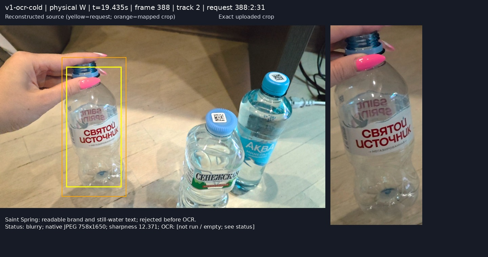
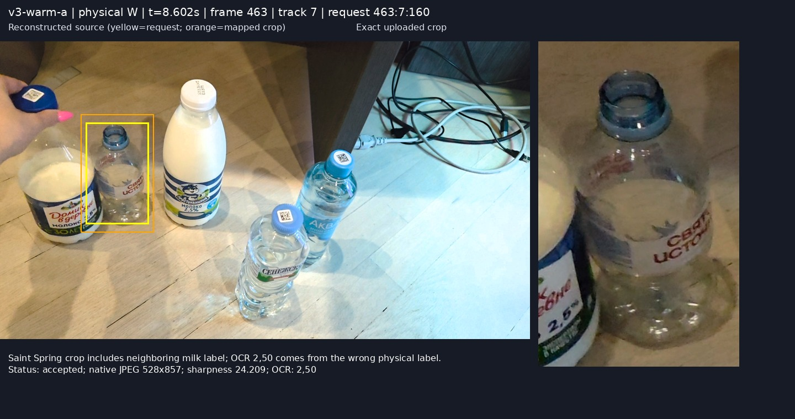

# Bottle video comparison — CPU browser replay

**Main finding:** failures are concentrated before Jev: readable crops rejected by the quality gate, missing/partial OCR, and neighboring labels inside crops. Jev also adds occasional long delays. No wrong **completed** identity was observed, but this small, repeated dataset does not establish accuracy or exact-SKU verification.

**Original-file blocker:** all three supplied files are HEVC Main 10. Chrome 153 played their audio/timeline while reporting `videoWidth=videoHeight=0`, zero decoded video frames, and no media error. The replay page silently submitted black 640×480 fallbacks in the original-file trials. This is a capture/format-handling failure, not detector/OCR failure. [Probe evidence](evidence/original-codec-probes.json).

## Scope and fair-comparison limits

| Video | Source format | Duration / average FPS | Scene |
|---|---|---|---|
| V1 — `20260921_205640.mp4` | 3840×2160 HEVC Main 10 | 48.09 s / 59.06 | Five bottles presented individually, then grouped; moving oblique camera |
| V2 — `20260921_205735.mp4` | Same | 11.17 s / 60.08 | Same layout; camera rises, then steadies |
| V3 — `20260921_205754.mp4` | Same | 12.95 s / 59.53 | Raised view; Domik rotates/moves, bottles touch, Senezhskaya moves |

The recognition comparison below uses **H.264 derivative copies**, generated with already-installed GStreamer: native 4K, all source frames, no resizing, 8-bit I420, constant quantizer 10. Frame counts match; duration differences are below 4 ms. This is not a bit-exact original-file comparison: 10→8-bit conversion, compression, timestamp quantization, and the much higher derivative bitrate can affect sampling and image quality. Sampled same-index image comparisons range approximately 30–41 dB PSNR; moving-frame alignment contributes to those differences. Preserve this caveat when interpreting angle effects. [Inventories](inventory.json), [derivatives](evidence/compatible-inventory.json), [conversion check](evidence/transcode-frame-alignment-v1.json).

Actual unmodified browser page → small JPEG → backend detector/tracker → browser-requested native crop → CPU OCR → existing Jev classifier was used. PP-YOLOE+ Small Objects365, 640 inference size, PP-OCRv5 Cyrillic CPU, existing 8-product catalog, blur gate 15, submit intervals 0.75/2 s, 12 s Jev debounce, completion threshold 0.70, four Jev workers. No models, recognition rules, thresholds, dependencies, or project source were changed. [Source hashes](source-unchanged.json).

Two runs per video, fresh sessions: V1 first, V2a, V3a, V1 repeat, V2b, V3b. Detector model-loading delay was not timed. Detector was already warmed by the black-frame probes; **only the first real V1 run was OCR-cold**. OCR initialization took 0.837 s. Later runs were warm. Each recording had about 20 s of post-roll for pending work. Browser collection and measurement logging were identical; their overhead and concurrent CPU decoding/OCR limit throughput. Observed sampling was only **1.24–1.68 frames/s**, not 60 FPS, with one detection in flight and no detection backlog.

Exactly **40 external calls were attempted: 37 returned validated results, three failed**. The cap blocked later V3b attempts; that run is censored for Jev success, while its OCR/crop evidence remains usable. Existing reference-photo Jev results were inspected but not reused as video outcomes.

## Physical-bottle results

A = Aqua Minerale 0.5 L still; S = Сенежская 0.5 L still; W = Святой источник 0.75 L still; P = Простоквашино 930 ml 2.5%; D = Домик в деревне 930 ml 2.5%. Ground truth uses the supplied description and continuous physical motion, independently of tracker IDs. Sizes/variants are catalog expectations; they are not assumed visible in every frame. [Ground-truth timeline](ground-truth.md).

Each cell gives **run a / run b**. Media seconds describe captured source positions. Wall seconds are observed elapsed time from clicking Play, on the browser clock. They are separate clocks: do not subtract one column from another. A candidate is a correct catalog choice, not independent SKU confirmation. “Completed” means the existing scheduler accepted it and stopped further OCR for that evidence object. `—` means not observed; final-repeat Jev censoring is explicit. OCR/Jev counts are `OCR executions / external calls`, separately for each run.

| Video / physical bottle | First detection, media s | First submitted crop, media s | First correct candidate, wall s | First completed, wall s | OCR runs / Jev calls |
|---|---:|---:|---:|---:|---:|
| V1 / A | 1.73 / 1.67 | 3.32 / 4.41 | 7.85 / 7.38 | 7.85 / 7.38 | 3/2 ; 2/2 |
| V1 / S | 9.64 / 9.72 | 9.64 / 9.72 | 12.74 / 12.68 | 12.74 / 12.68 | 2/2 ; 2/2 |
| V1 / W | 18.87 / 18.64 | — / — | — / — | — / — | 0/0 ; 0/0 |
| V1 / P | 27.41 / 27.78 | 38.14 / 38.16 | — / — | — / — | 3/1 ; 3/2 |
| V1 / D | 37.54 / 37.56 | 39.42 / 38.77 | 44.20 / 65.37 | 56.89 / 65.37 | 2/2 ; 4/2 |
| V2 / A | 0.68 / 0.69 | 0.68 / 1.95 | 5.04 / — | 5.04 / — | 1/1 ; 3/0 |
| V2 / S | 0.68 / 0.69 | 1.23 / 1.25 | 6.09 / 27.07 | 6.09 / 27.07 | 1/1 ; 3/2 |
| V2 / W | 0.68 / 0.69 | 3.06 / 2.97 | — / — | — / — | 2/0 ; 2/1 |
| V2 / P | 0.68 / 0.69 | 0.68 / 0.69 | — / — | — / — | 4/2 ; 4/2 |
| V2 / D | 0.68 / 0.69 | 0.68 / 1.95 | — / — | — / — | 2/2 ; 2/0 |
| V3 / A | 0.71 / 0.70 | 0.71 / 0.70 | 5.00 / 5.03 | — / censored | 5/2 ; 5/1 |
| V3 / S | 0.71 / 0.70 | 1.25 / 1.26 | 5.00 / — | 5.00 / censored | 1/1 ; 4/1 |
| V3 / W | 0.71 / 0.70 | 5.82 / 3.64 | — / — | — / censored | 3/2 ; 4/1 |
| V3 / P | 0.71 / 0.70 | 0.71 / 0.70 | — / — | — / censored | 5/2 ; 5/1 |
| V3 / D | 0.71 / 0.70 | 0.71 / 0.70 | — / — | — / censored | 4/2 ; 4/1 |

Uncensored completed products: **V1 3/5 and 3/5; V2 2/5 and 1/5; V3a 1/5**. No wrong completed identity was observed. Aqua in both V3 runs briefly received the correct candidate below the completion threshold (0.50/0.44), then remained unresolved. These scores are not calibrated correctness probabilities. No product's exact SKU attributes were independently confirmed by the pipeline.

For observed detection-to-completion wall delay: V1 A 5.17/4.76 s, S 2.10/1.99 s, D 18.33/26.79 s; V2 A 3.42 s in a, S 4.47/25.43 s; V3a S 3.33 s. The detailed [per-bottle CSV](per-bottle.csv) includes first OCR completion, first brand/variant evidence, submitted-crop counts, track IDs, and censored cases; [per-request CSV](per-request.csv) preserves identifiers, scores, timings, and image paths.

## Where the pipeline loses evidence

| Finding | Concrete evidence | Interpretation |
|---|---|---|
| Quality gate rejects readable close labels | V1a **19.435 s / f388 / track2 / `388:2:31`**, W: native 758×1650 crop visibly reads «СВЯТОЙ ИСТОЧНИК», sharpness **12.37**, rejected `blurry`. Across V1a/b, W had **24/25 rejections and zero OCR executions**. V1a **28.536 s / f404 / track2 / `404:2:61`**, P: readable curved brand, sharpness **11.68**, also rejected. | Strong evidence of lost readable opportunities at the pre-OCR gate. Global Laplacian variance depends on image scale/composition; this does not justify simply lowering the threshold. |
| OCR can miss a clear accepted label | V3b **3.644 s / f571 / track3 / `571:3:311`**, D: readable front brand, milk/fat/volume text; sharpness **31.60**, accepted, OCR **done with zero lines**. V2a **0.683 s / f437 / track3 / `437:3:121`**, P: OCR reads «МОЛОКО / 2,5%», misses the brand. | OCR-stage loss is demonstrated. Export lacks text-detection polygons, so text localization vs recognition cannot be separated. Curvature/perspective/stylized lettering are hypotheses. |
| Raised view weakens brand evidence | V2a **0.683 s / f437 / track4 / `437:4:122`** reads `AKBA`, accepted Aqua. V2b **1.952 s / f553 / track4 / `553:4:285`** reads only `AKB`, repeatedly; no Jev call for that track. | Existing useful-evidence gate requires a ≥4-character token or two ≥2-character tokens. A sole 3-character `AKB` does not trigger Jev. This is not a Jev mismatch. |
| Neighbor labels contaminate otherwise correct crops | V3a **8.602 s / f463 / track7 / `463:7:160`**, W crop contains the adjacent Domik milk label; OCR reads `2,50`, not W's brand. V3b **12.254 s / f580 / track3 / `580:3:329`**, S crop includes P's `2,5%` above it; OCR combines that with «СЕНЕЖСКАЯ». | Rectangular detection boxes plus margin include multiple labels. Mapping can be numerically correct while evidence belongs to a neighbor. No resulting wrong accepted identity was demonstrated. |
| Crop requests can be superseded before arrival | V1a **1.727 s / f358 / track2 / `358:2:1`**: frame358 response finished at server 2752.833; frame359 issued its replacement before the old crop arrived at 2753.357. Old crop rejected `unknown_request`. **14** such rejections across six runs. | Existing latest-per-track replacement races asynchronous native crop encoding/transport. Not a reset failure or OCR rejection. |
| Track ownership is unstable around motion/occlusion | V1 track2 successively follows A, S, W, P; A fragments to track4 (track3 in repeat), S to5. V3a track2 follows W/hand then D; W reappears as7. V3b D changes3→8, S5→3 at f580. See [track sheets](frames/v3-warm-b-track-audit.jpg). | Numeric ID reuse and fragmentation are real. Some wrist/part-bottle boxes are ambiguous. The reviewed snapshots show evidence reset across the relevant gaps; no proven completed identity transferred to a different bottle. |

All **329 requested rectangles and all 329 uploaded JPEG dimensions** matched the independent coordinate calculation: scales **6× horizontally and 4.5× vertically**, existing 8% margin and clamping. [Mapping audit](mapping-audit.json). No numerical crop-mapping defect was found.

However, the built-in export drops every 4K original frame. Its media timestamp is `currentTime`, not the decoded frame's presentation timestamp. Thirteen examples reconstruct source frames by matching each exact crop near the recorded time; these are **not retained originals**. In the first 12 inspected cases, best visual matches precede the reported timestamp by roughly **0.08–0.37 s**. That suggests decode/presentation lag and/or timestamp-alignment effects; it does not prove a detection/crop frame mismatch. Exact same-frame identity cannot be independently certified from this export.

No cross-session source IDs or older-session responses were found in run logs. Each run had at most one detection in flight. Deliberately overlapping reset with an in-flight Jev call was not exercised, so this is not proof that every reset race is absent. Completed identities did stop subsequent collection for their evidence object; a wrong completed identity would therefore be sticky, but none was observed here. [Lifecycle audit](lifecycle-audit.json).

## Timing and camera-view interpretation

Median crop request→receipt was **391–564 ms** across runs. This includes server response work, browser encoding, transport and socket queueing, not just network latency. OCR queue/startup medians ranged **3–335 ms**, maximum **1.72 s**; OCR execution medians **334–929 ms**, maximum **1.69 s**. These use server monotonic time only. The first accepted Aqua crop (`361:2:4`) spent **360 ms** request→receipt, **840 ms** queue/startup (including 837 ms OCR initialization), **1,018 ms** OCR, then **901 ms** Jev. [Timing definitions](instrumentation-audit.md), [run distributions](comparison-summary.json).

Typical Jev execution was **0.8–0.95 s**, but two successful calls took about **10.8 s**, and three failed after about **10 s**. Warm V1 D's first call failed; its next attempt started **12.85 s after failure**, producing completion at wall **65.37 s**, after the 48 s recording ended. V2b S similarly failed then retried after **12.26 s**, completing at **27.07 s** despite an 11 s video. These delays are predominantly external-call failure plus existing retry/debounce behavior, not slow OCR. Network setup versus remote service time cannot be separated with current instrumentation. [All calls and evidence sources](jev-calls.json).

Jev attribution uses **all contributing request IDs**: V1a D's initial candidate from `422:6:109` was 0.56; the later accepted 0.77 used `422:6:109` **and** `434:6:118`. The built-in latest-result export alone hides the earlier candidate; browser/server event logs preserve it.

Higher camera position improves separation but reduces text scale and increases foreshortening. Representative native Aqua crops shrink from **727×1722** (V1a, `361:2:4`) to **541×1211** (early V2a, `437:4:122`) to **451×1007** (raised V2b, `553:4:285`). Approximate capital-letter heights decrease from **80–100 px** to **50–65 px** to **35–50 px**, with the final letter wrapping away. Yet the raised view has *fewer* blur-gate rejections: V1 **84%/82%**, V2 **17%/23%**, V3 **32%/24%**. Thus “higher camera = worse blur” is unsupported. Label direction, colored lighting, background inclusion, movement, hand occlusion, and sampling differences confound angle. No calibrated camera heights/degrees were supplied.

## Ranked fixes to evaluate — not implemented

| Rank | Proposed work | Expected benefit | Effort / accuracy risk |
|---|---|---|---|
| 1 | Reject media with no decoded video track; show a codec-specific error before detection uploads | Removes the demonstrated silent black-frame failure on all supplied originals | Low / very low |
| 2 | Add bounded sampled-original/decoded-PTS capture, per-request sharpness, and OCR text boxes; then evaluate a scale-aware quality gate on labeled readable/unreadable crops | Makes the 49 lost W opportunities and empty D OCR diagnosable; avoid threshold-only tuning | Medium / low instrumentation risk; gate changes need accuracy evaluation |
| 3 | Evaluate label-region/perspective handling and neighboring-label exclusion on the saved crops | Addresses curved logos, partial `AKB`, and milk-text contamination | Medium–high / medium–high; can remove useful text |
| 4 | Separate failed-call retry timing from successful-result debounce, with a bounded budget | Targets observed 12 s waits after external failures | Low–medium / low recognition risk, higher API cost risk |
| 5 | Test track-association continuity and evidence invalidation under occlusion/ID reuse | Prevents future sticky wrong identities; current evidence shows instability, not a proven wrong acceptance | Medium / medium; overly aggressive resets lose good evidence |

**One next implementation task:** validate a decodable video frame before replay starts. Acceptance: each supplied HEVC file in this Chrome either decodes a nonzero-size frame or shows a clear unsupported-video error; audio-only/video-less media sends **zero detection JPEGs**; supported H.264 copies still replay, pause and restart through the existing crop pipeline. No model/threshold changes. This is the smallest verified blocker to remove first.

## Reviewable evidence

Open the [annotated side-by-side gallery](examples/index.html); every panel links the exact native crop and explicitly labeled reconstructed source. Examples below preserve the requested frame/track/request attribution.

Native exports are in `evidence/<run>/replay-evidence.json`. A supplemental once-per-second observer saved all 329 crops before ring-buffer eviction, plus response history, without altering recognition logic. Browser drop counts include both omitted 4K originals and evicted records; server request-collection eviction was zero. `per-request.csv`, `per-bottle.csv`, `jev-calls.csv`, source inventories, event logs, and measurement scripts are included. Compatible videos occupy about 2.4 GiB and remain local; the review archive excludes those large derivative files. No credentials or authorization headers were collected.
